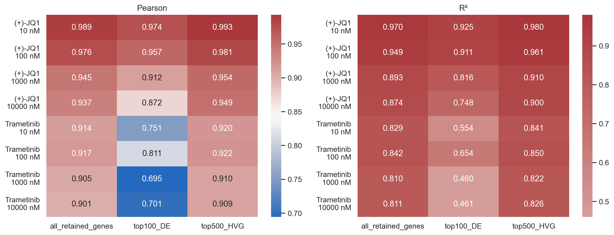
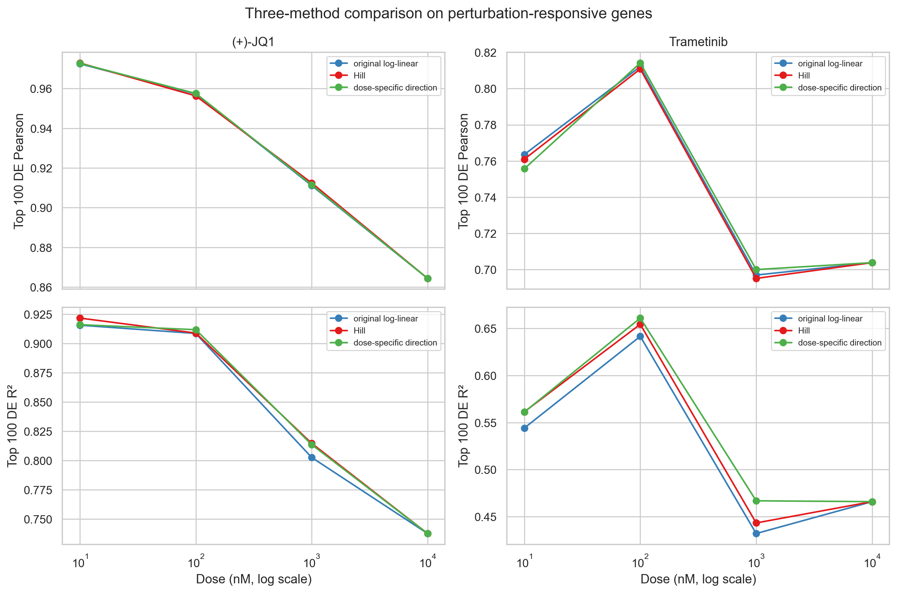
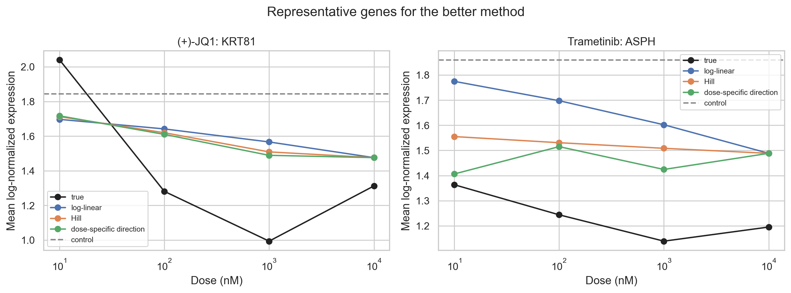
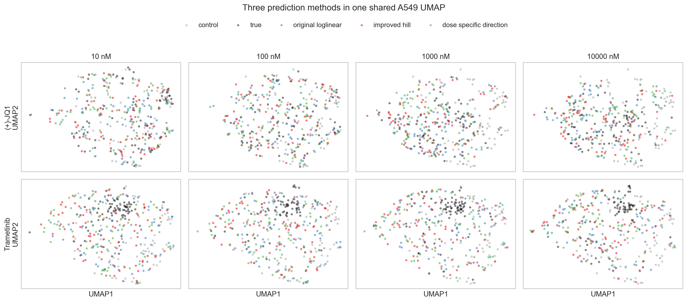

# 单细胞药物扰动响应预测与剂量建模

本仓库是基于 **scVIDR** 和 **sci-Plex 3** 数据完成的单细胞药物扰动预测考核项目。项目以 A549 为目标细胞系，在训练阶段完全隐藏其药物处理样本，仅利用 A549 对照细胞以及 K562、MCF7 的对照和给药数据，预测 A549 在不同药物与剂量下的转录组响应。

项目完成了以下工作：

1. 使用变分自编码器和潜空间扰动回归完成未见 A549 给药条件的表达预测；
2. 保留并复现 scVIDR 原始对数线性剂量模型；
3. 使用归一化 Hill 函数改进非线性剂量响应建模；
4. 进一步提出剂量特异方向回归（Dose-Specific Direction Regression，DSDR）；
5. 使用 Pearson、$R^2$、代表性基因剂量曲线和共同 UMAP 进行评价；
6. 提供完整 Python 代码、结果数据、图表以及 LaTeX/PDF 报告。

## 实验设计

### 数据与条件

- 数据集：Srivatsan 等人发布的 sci-Plex 3 单细胞化学扰动数据；
- 目标细胞系：A549；
- 源细胞系：K562、MCF7；
- 目标药物：`(+)-JQ1`、`Trametinib (GSK1120212)`；
- 非零剂量：10、100、1,000、10,000 nM；
- 时间点：24 h；
- 建模基因：从训练集选择的 2,000 个高变基因；
- 最终数据规模：6,892 个细胞，其中训练集 5,370 个，测试集 1,522 个。

### 防止数据泄漏

A549 的两种药物、全部非零剂量样本均只用于最终测试。以下步骤仅使用训练集完成：

- 表达基因过滤；
- 总量归一化与 `log1p` 变换；
- 高变基因选择；
- VAE 训练；
- 潜空间扰动回归；
- Hill 参数及其他剂量模型拟合。

## 方法

### 任务一：条件特异 scVIDR

首先训练 VAE，将 2,000 维表达向量压缩到 32 维潜空间。对每个源细胞系、药物和剂量，计算处理组与对照组的潜空间中心差：

$$
\Delta_{c,p,d}=\bar z_{c,p,d}-\bar z_{c,\mathrm{control}}.
$$

随后根据 K562 和 MCF7 的响应，对 A549 的条件特异扰动向量进行线性外推。将预测向量加到 A549 对照细胞的潜表示后，通过 VAE 解码器生成处理后表达。

### 任务二原模型：对数线性缩放

原始多剂量模型使用最大剂量扰动方向，并按照对数剂量比例缩放：

$$
\alpha_{\log}(d)=\frac{\log(d+1)}{\log(d_{\max}+1)}.
$$

该方法稳定且无需额外拟合，但假设所有剂量共享同一潜空间方向。

### 改进方法一：归一化 Hill 函数

为表示阈值、转折和饱和效应，引入归一化 Hill 函数：

$$
\alpha_{\mathrm{Hill}}(d)=
\frac{d^h/(EC_{50}^h+d^h)}
{d_{\max}^h/(EC_{50}^h+d_{\max}^h)}.
$$

参数完全根据 K562、MCF7 的训练响应拟合，不使用 A549 给药真值。

### 改进方法二：DSDR

Hill 模型仍只能调整最大剂量扰动向量的长度。DSDR 为每个药物—剂量条件独立估计潜空间响应，并将该响应跨细胞系回归到 A549，因此允许响应方向随剂量变化：

$$
\Delta_{c,p,d,j}=a_{p,d,j}\bar z_{c,\mathrm{ctrl},j}+b_{p,d,j}.
$$

DSDR 是本项目中恢复关键差异表达基因效果最好的方案。

### 其他探索方法

在确定 Hill 和 DSDR 作为正式改进方案前，还尝试了四种训练数据驱动的方法。相关探索代码或结果均被保留，测试集只用于最终评价。

#### 1. 经验单调校准

对应代码：[任务二/explore_calibrated_method.py](任务二/explore_calibrated_method.py)。

该方法不预设对数或 Hill 曲线，而是根据 K562、MCF7 在不同剂量下的潜空间投影比例，使用单调回归估计药物特异的经验缩放系数，再将其应用于 A549 最大剂量扰动方向。

- 全基因平均 $R^2$ 增益：**-0.0022**；
- Top-100 DE 平均 $R^2$ 增益：**+0.0082**。

该方法对关键响应基因有效，但仍假设不同剂量共享同一潜空间方向，且整体效果弱于 DSDR，因此未被选为最终方案。

#### 2. 源细胞系残差迁移

对应结果：[任务二/residual_transfer_exploration_metrics.csv](任务二/residual_transfer_exploration_metrics.csv)。

该方法先计算源细胞系真实剂量响应与对数线性预测之间的残差，再尝试将平均残差迁移到 A549，以校正原模型无法解释的非线性部分。

- 全基因平均 $R^2$ 增益：**-0.0022**；
- Top-100 DE 平均 $R^2$ 增益：**-0.0026**。

结果表明，K562 和 MCF7 的剩余误差包含较强的细胞系特异成分，不能直接稳定迁移到 A549。

#### 3. DE 门控混合模型

对应代码：[任务二/explore_de_gated_hybrid.py](任务二/explore_de_gated_hybrid.py)。

该方法根据训练集中的差异表达强度构造基因级权重，仅对高响应基因加强改进模型的修正，而让稳定基因更多保留原始对数线性预测，以缓解“Top-100 DE 提升但全基因退化”的矛盾。

- 全基因平均 $R^2$ 增益：**-0.0016**；
- Top-100 DE 平均 $R^2$ 增益：**+0.0028**。

该方案能够小幅改善差异表达基因，但增益有限，并引入了额外的基因级权重与阈值复杂度。

#### 4. 目标对照锚定

对应代码：[任务二/explore_control_anchor.py](任务二/explore_control_anchor.py)。

该方法利用 A549 对照表达与源细胞系对照表达之间的差异，对迁移后的剂量响应进行目标域锚定，希望减少细胞系基线差异造成的偏移。

- 全基因平均 $R^2$ 增益：**-0.0015**；
- Top-100 DE 平均 $R^2$ 增益：**-0.0328**。

目标对照锚定对强响应基因造成明显退化，说明对照状态差异不能简单等同于给药后响应差异。

#### 探索结果汇总

| 探索方法 | 全基因平均 $R^2$ 增益 | Top-100 DE 平均 $R^2$ 增益 | 是否采用 |
|---|---:|---:|---|
| 经验单调校准 | -0.0022 | +0.0082 | 否，弱于 DSDR |
| 源细胞系残差迁移 | -0.0022 | -0.0026 | 否 |
| DE 门控混合模型 | -0.0016 | +0.0028 | 否，增益较小 |
| 目标对照锚定 | -0.0015 | -0.0328 | 否 |

这些探索说明，只调整响应幅度、迁移源域误差或使用对照差异后处理，都不能稳定改善跨细胞系预测。DSDR 的优势主要来自放松“所有剂量共享同一扰动方向”这一结构假设。详细讨论见 [任务二/更好方法.md](任务二/更好方法.md) 和 [完整考核报告](报告/考核报告.pdf)。

## 主要结果

### 任务一

在 8 个 A549 测试条件的全部保留基因上：

- Pearson 相关系数范围：**0.9013–0.9885**；
- $R^2$ 范围：**0.8096–0.9698**；
- 相比直接使用 A549 对照均值的基线，scVIDR 在 **5/8** 个条件上取得更高的 $R^2$。

| 药物 | 剂量/nM | Pearson | $R^2$ |
|---|---:|---:|---:|
| (+)-JQ1 | 10 | 0.9885 | 0.9698 |
| (+)-JQ1 | 100 | 0.9759 | 0.9486 |
| (+)-JQ1 | 1,000 | 0.9454 | 0.8930 |
| (+)-JQ1 | 10,000 | 0.9372 | 0.8738 |
| Trametinib | 10 | 0.9141 | 0.8295 |
| Trametinib | 100 | 0.9175 | 0.8415 |
| Trametinib | 1,000 | 0.9048 | 0.8096 |
| Trametinib | 10,000 | 0.9013 | 0.8111 |

### 剂量模型比较

在 Top-100 差异表达基因上：

- Hill 模型在 6/6 个非最大剂量条件上提高 $R^2$；
- Hill 在全部 8 个条件上的平均 $R^2$ 增益为 **0.0075**；
- DSDR 同样在 6/6 个非最大剂量条件上提高 $R^2$；
- DSDR 的平均 $R^2$ 增益为 **0.0107**；
- 最大增益出现在 Trametinib 1,000 nM，$R^2$ 从 0.4320 提升至 **0.4668**，增益为 **0.0348**。

| 药物 | 剂量/nM | 对数线性 $R^2$ | Hill $R^2$ | DSDR $R^2$ |
|---|---:|---:|---:|---:|
| (+)-JQ1 | 10 | 0.9157 | **0.9217** | 0.9161 |
| (+)-JQ1 | 100 | 0.9086 | 0.9089 | **0.9118** |
| (+)-JQ1 | 1,000 | 0.8027 | **0.8147** | 0.8136 |
| (+)-JQ1 | 10,000 | 0.7377 | 0.7377 | 0.7377 |
| Trametinib | 10 | 0.5441 | **0.5614** | 0.5611 |
| Trametinib | 100 | 0.6416 | 0.6544 | **0.6610** |
| Trametinib | 1,000 | 0.4320 | 0.4433 | **0.4668** |
| Trametinib | 10,000 | 0.4659 | 0.4659 | 0.4659 |

DSDR 更擅长恢复强响应基因，但其全基因平均 $R^2$ 相对原模型下降约 0.0038。因此，本项目的结论是：DSDR 在关键差异表达响应上优于标量剂量插值，但并非在所有评价口径上全面优于原模型。

## 结果图示

### 任务一指标



### 剂量模型对比



### 代表性基因剂量曲线



### 共同 UMAP



## 仓库结构

```text
SingleCellDoseResponse/
├── data/                       # 原始数据目录，不上传到 Git
├── docs/
│   └── 要求.md                 # 考核任务要求
├── 任务一/
│   ├── run_task1.py            # 数据预处理、VAE 训练与条件特异预测
│   ├── README.md               # 任务一结果说明
│   ├── metrics.csv             # 分条件评价指标
│   └── figures/                # 指标图与共同 UMAP
├── 任务二/
│   ├── original_scvidr_loglinear.py
│   ├── hill_dose_model.py
│   ├── dose_specific_direction.py
│   ├── run_task2.py            # 对数线性与 Hill 正式实验
│   ├── run_better_method.py    # DSDR 正式实验
│   ├── explore_*.py            # 其他探索性方法
│   ├── README.md
│   ├── 更好方法.md
│   ├── metrics_three_methods.csv
│   └── figures/
├── 报告/
│   ├── 考核报告.tex            # XeLaTeX 源文件
│   ├── 考核报告.pdf            # 完整考核报告
│   └── figures/
├── 01_inspect_data.py          # 原始数据结构检查
└── requirements.txt
```

## 环境配置

实验使用的主要环境如下：

- Python 3.8.5；
- Scanpy 1.9.1；
- AnnData 0.8.0；
- PyTorch 1.8.1 + CUDA 11.1；
- NVIDIA GeForce RTX 3070 Laptop GPU。

环境已经创建时，可直接激活：

```bash
conda activate scVIDR
```

若需重新配置，可参考：

```bash
conda create -n scVIDR python=3.8.5
conda activate scVIDR
pip install -r requirements.txt
pip install geomloss==0.2.5
pip install torch==1.8.1+cu111 torchaudio==0.8.1 torchvision==0.9.1 \
  -f https://download.pytorch.org/whl/torch_stable.html
```

## 数据准备

将原始文件放置为：

```text
data/SrivatsanTrapnell2020_sciplex3.h5ad
```

原始数据、派生 H5AD 文件、训练权重和运行缓存体积较大，已通过 `.gitignore` 排除。仓库保留了轻量指标、图表和配置文件。

## 运行方法

在仓库根目录依次执行：

```bash
conda activate scVIDR

# 任务一：预处理、训练 VAE 并预测 A549 给药响应
python 任务一/run_task1.py

# 任务二：复现对数线性模型并拟合 Hill 模型
python 任务二/run_task2.py

# 进一步改进：运行 DSDR
python 任务二/run_better_method.py
```

所有脚本均使用固定随机种子。运行配置分别记录在 `任务一/run_config.json`、`任务二/run_config.json` 和 `任务二/better_method_run_config.json`。

## 报告

- [完整 PDF 报告](报告/考核报告.pdf)
- [LaTeX 源文件](报告/考核报告.tex)
- [任务一结果说明](任务一/README.md)
- [任务二结果说明](任务二/README.md)
- [DSDR 方法说明](任务二/更好方法.md)

报告使用 XeLaTeX 编译：

```bash
cd 报告
xelatex 考核报告.tex
xelatex 考核报告.tex
```

## 原模型保留说明

任务二未覆盖任务一模型及原始实现：

- 原始对数线性实现：`任务二/original_scvidr_loglinear.py`；
- 原任务一脚本及模型元数据保留在 `任务一/`；
- 完整性记录：`任务二/preservation_manifest.json`。

## 致谢与引用

本项目基于 Bhattacharya Lab 发布的 [scVIDR](https://github.com/BhattacharyaLab/scVIDR) 代码开展。原始方法与数据请引用：

1. Kana O, Nault R, Filipovic D, et al. *Generative modeling of single-cell gene expression for dose-dependent chemical perturbations*. Patterns, 2023. DOI: [10.1016/j.patter.2023.100817](https://doi.org/10.1016/j.patter.2023.100817)。
2. Srivatsan SR, McFaline-Figueroa JL, Ramani V, et al. *Massively multiplex chemical transcriptomics at single-cell resolution*. Science, 2020. DOI: [10.1126/science.aax6234](https://doi.org/10.1126/science.aax6234)。

## 许可证

原始 scVIDR 代码及本仓库内容遵循仓库中的 [LICENSE](LICENSE)。
