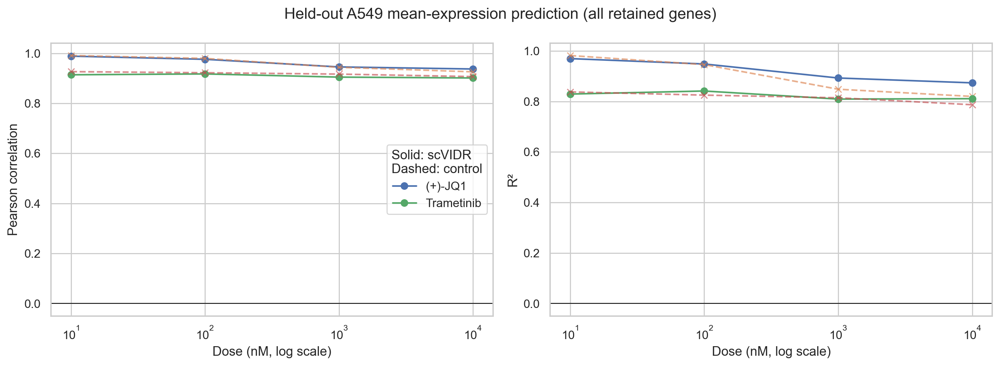
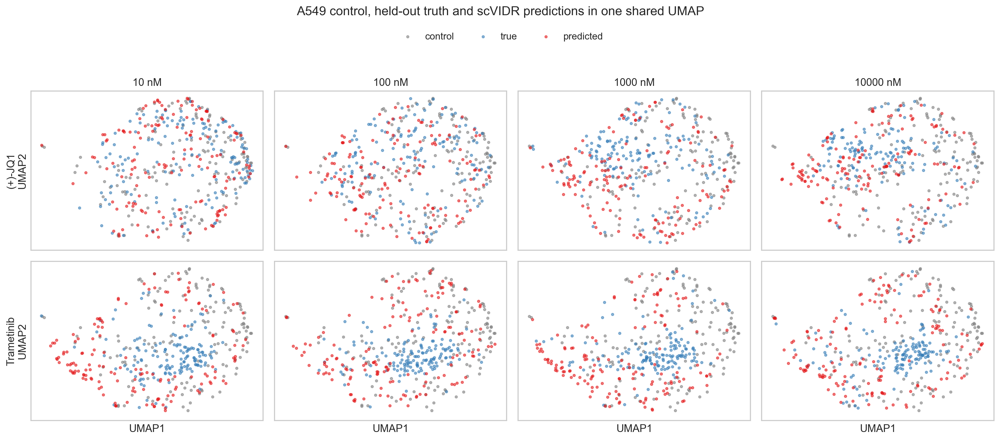

# 任务一：scVIDR 单细胞药物扰动响应预测

## 结论摘要

本实验以 **A549** 为完全留出的目标细胞系，测试 **(+)-JQ1** 和 **Trametinib (GSK1120212)** 在 10、100、1000、10000 nM（24 h）下的响应。模型未看到任何 A549 的测试药物非零剂量细胞。八个条件在全部 2,000 个保留基因上的结果如下。

| drug | dose_nM | pearson | r2 | control_baseline_pearson | control_baseline_r2 |
| --- | --- | --- | --- | --- | --- |
| (+)-JQ1 | 10.0 | 0.9885 | 0.9698 | 0.9910 | 0.9820 |
| (+)-JQ1 | 100.0 | 0.9759 | 0.9486 | 0.9795 | 0.9461 |
| (+)-JQ1 | 1000.0 | 0.9454 | 0.8930 | 0.9439 | 0.8486 |
| (+)-JQ1 | 10000.0 | 0.9372 | 0.8738 | 0.9259 | 0.8200 |
| Trametinib (GSK1120212) | 10.0 | 0.9141 | 0.8295 | 0.9266 | 0.8380 |
| Trametinib (GSK1120212) | 100.0 | 0.9175 | 0.8415 | 0.9222 | 0.8253 |
| Trametinib (GSK1120212) | 1000.0 | 0.9048 | 0.8096 | 0.9168 | 0.8147 |
| Trametinib (GSK1120212) | 10000.0 | 0.9013 | 0.8111 | 0.9068 | 0.7872 |

按药物跨剂量平均：

| drug | pearson | r2 | control_baseline_pearson | control_baseline_r2 |
| --- | --- | --- | --- | --- |
| (+)-JQ1 | 0.9618 | 0.9213 | 0.9601 | 0.8992 |
| Trametinib (GSK1120212) | 0.9094 | 0.8229 | 0.9181 | 0.8163 |

最高 R² 条件为 **(+)-JQ1 / 10 nM**（R²=0.9698）；最低为 **Trametinib (GSK1120212) / 1000 nM**（R²=0.8096）。CSV 同时给出“直接使用 A549 对照均值”的朴素基线。scVIDR 在 5/8 个条件上提高 R²，平均变化为 +0.0144；这说明总体跨基因相关性虽高，但其中一部分来自稳定的细胞系表达背景，模型是否恢复扰动必须结合基线、DE 基因指标和 UMAP 判断。




Top 100 DE 基因比全基因更严格：其 Pearson 范围为 0.6946–0.9742，R² 范围为 0.4605–0.9250。Trametinib 的 DE 指标明显低于其全基因指标，说明模型较好保留了整体表达背景，但对强扰动基因的幅度恢复仍有限。

## scVIDR 原理

scVIDR 先用变分自编码器（VAE）将高维基因表达编码到低维潜在空间。对于每个药物—剂量条件，在非目标细胞系中计算处理与对照潜在中心之差（扰动向量）；随后用对照潜在中心到扰动向量的线性回归，把跨细胞系观察到的响应外推到目标 A549。最后将 A549 对照细胞的潜在表示加上预测扰动向量并经解码器还原为基因表达。这里每个剂量独立估计方向，属于任务一的条件级扰动预测，不使用任务二的剂量插值。

## 数据预处理与划分

- 原始文件：`data/SrivatsanTrapnell2020_sciplex3.h5ad`（799,317 个细胞，110,983 个原始特征）。
- 选择依据：两个药物在 A549、K562、MCF7 的 24 h 数据中均具备四个非零剂量，且每个目标测试条件有 167–223 个细胞；满足至少三个剂量且细胞数充足的要求。
- 训练集：A549/K562/MCF7 的 0 nM 对照（每系固定随机抽样至 500 个），以及 K562、MCF7 中两个测试药物的全部四剂量（每组合至多 300 个）。
- 测试集：A549 中两个测试药物的全部四剂量细胞，不抽样，共 1,522 个。
- 预处理：仅使用训练细胞拟合过滤与 HVG 选择（避免测试泄漏）；基因至少在 20 个训练细胞表达；所有细胞按相同规则将总量归一化至 10,000 并 `log1p`；再按训练集 Seurat dispersion 精确保留 2,000 个 HVG。VAE 为 2 层、256 隐单元、32 维潜变量，最多 60 epochs，early stopping patience=15，随机种子 20260913。
- 硬件：NVIDIA GeForce RTX 3070 Laptop GPU。总脚本运行时间约 0.8 分钟。

详细实际细胞数见 `split_counts.csv`，选定基因及 HVG 排名见 `selected_genes.csv`。

## 评价定义与解读

每个测试条件分别计算真实细胞与预测细胞的基因均值。`Pearson` 衡量跨基因模式的一致性；`R² = 1 - SSE/SST` 衡量绝对预测误差，因此允许为负值。分别评价全部保留基因、Top 500 HVG 和按该条件真实处理均值相对真实对照均值的绝对差选出的 Top 100 DE 基因。Top DE 是评价集合而非训练特征，使用真实测试标签选基因会带来评价集合选择上的信息使用，故不能视作完全无监督选基因；报告同时保留全基因和 HVG 指标作为主结果。

UMAP 将 A549 对照、真实处理和预测细胞合并，统一使用前述 log-normalized 表达矩阵，并在同一 PCA、邻接图和 UMAP 映射中计算，未分别拟合坐标。JQ1 的预测与真实细胞整体重叠较好；Trametinib 的预测覆盖了真实区域但更分散，提示单细胞分布的拟合弱于均值指标。



## 本任务中的稳健性改进

相对仓库示例流程，本实现增加了四点：HVG/基因过滤只在训练细胞上拟合以避免测试泄漏；固定随机种子并记录原始行号与实际划分；使用 early stopping 限制过拟合；为每个指标提供对照均值基线并补充 DE 基因评价，避免只报告容易被稳定背景抬高的全基因相关性。上游 `vidr.py` 漏导入 `LinearRegression` 的兼容问题也在本脚本内局部修复，未修改库源码。

## 结果文件说明

- `metrics.csv`：8 个条件 × 3 个基因集合的 Pearson、R² 与对照基线。
- `per_gene_mean_expression.csv.gz`：逐条件逐基因的真实、预测、对照均值及 DE/HVG 标记。
- `prediction_results.h5ad`：A549 对照、真实测试细胞及模型预测细胞（统一基因空间）。
- `umap_coordinates.csv`：绘图用共享 UMAP 坐标和细胞标签。
- `task1_preprocessed.h5ad`：可复用的归一化/HVG 后数据子集，含 `counts` 层。
- `model/`：已训练 scVIDR 模型；`training_history.csv` 为训练轨迹。
- `figures/`：指标曲线、指标热图和共享 UMAP。
- `run_task1.py`：从原始 h5ad 重新生成全部主要结果的入口。
- `run_config.json`：运行参数、软件版本和耗时。

## 局限与可改进点

数据只有两个非目标细胞系可供 scVIDR 的跨细胞系回归，回归样本数明显少于 32 维潜变量，外推稳定性受限。当前小规模实验还只纳入两个测试药物，VAE 对更广药物状态的表示能力有限。后续可增加训练药物、对潜在回归使用岭正则/降维、进行多随机种子与 bootstrap 置信区间，并与 pooled-delta、scGen、对照均值等基线系统比较。任务二还应在相同留出集上显式比较原始 log-linear 剂量插值和改进缩放函数。

## 复现

在仓库根目录执行：

```powershell
conda activate scVIDR
python "任务一/run_task1.py"
```

若希望复用已生成的预处理数据、仅重新训练与评估，增加 `--reuse-preprocessed`。固定随机种子降低随机性，但 GPU 算子和旧版 PyTorch/scvi-tools 仍可能造成细微数值差异。
