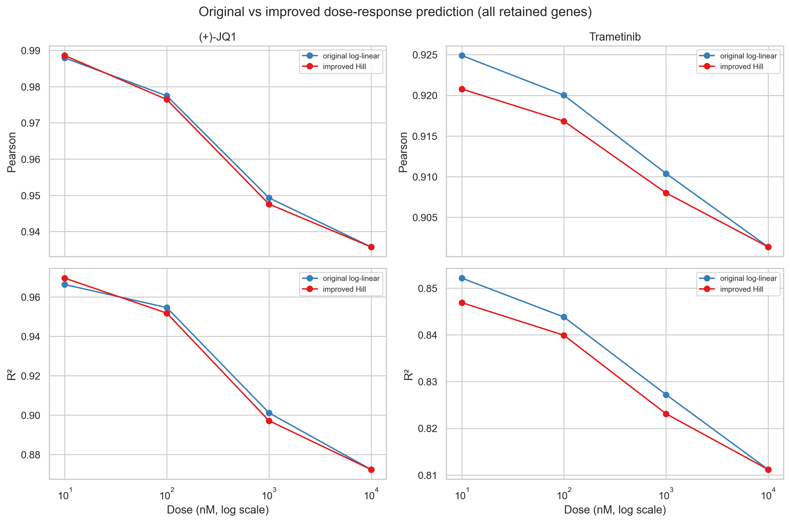
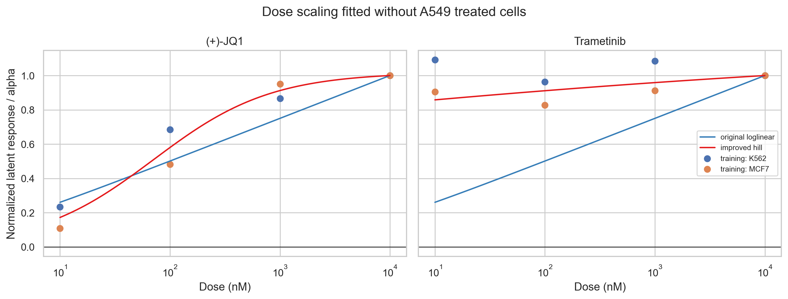
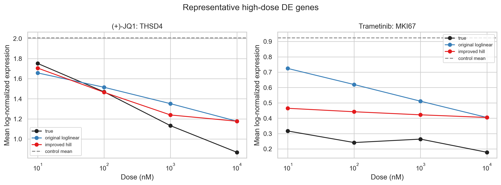
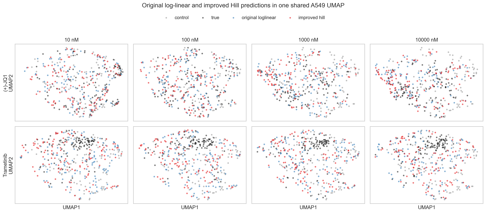

# 任务二：剂量响应建模与方法改进

> 后续第三种方法实验已完成：剂量特异方向回归（DSDR）在 Top 100 DE 基因上比原始 log-linear 平均提高 R² **+0.0107**，高于本报告 Hill 方法的 **+0.0075**。完整三方法结果见 [`更好方法.md`](更好方法.md)，代码见 `dose_specific_direction.py` 与 `run_better_method.py`。原始模型与以下 Hill 结果均完整保留。

## 结论

本任务保留并复用任务一已经训练好的 scVIDR VAE，在同一个 A549 完全留出测试集上比较：

1. 原始方法：$\alpha_{log}(d)=\log(1+d)/\log(1+d_{max})$；
2. 改进方法：只使用 K562、MCF7 训练数据拟合的药物特异性归一化 Hill 函数。

全部 2,000 个保留基因的逐条件结果如下：

| drug | dose_nM | pearson_original_loglinear | pearson_improved_hill | pearson_improvement | r2_original_loglinear | r2_improved_hill | r2_improvement |
| --- | --- | --- | --- | --- | --- | --- | --- |
| (+)-JQ1 | 10.0 | 0.9879 | 0.9886 | 0.0007 | 0.9664 | 0.9696 | 0.0033 |
| (+)-JQ1 | 100.0 | 0.9775 | 0.9764 | -0.0010 | 0.9546 | 0.9518 | -0.0028 |
| (+)-JQ1 | 1000.0 | 0.9493 | 0.9476 | -0.0017 | 0.9012 | 0.8972 | -0.0040 |
| (+)-JQ1 | 10000.0 | 0.9358 | 0.9358 | 0.0000 | 0.8724 | 0.8724 | 0.0000 |
| Trametinib (GSK1120212) | 10.0 | 0.9249 | 0.9208 | -0.0041 | 0.8521 | 0.8469 | -0.0053 |
| Trametinib (GSK1120212) | 100.0 | 0.9200 | 0.9168 | -0.0032 | 0.8438 | 0.8399 | -0.0039 |
| Trametinib (GSK1120212) | 1000.0 | 0.9104 | 0.9080 | -0.0024 | 0.8272 | 0.8231 | -0.0041 |
| Trametinib (GSK1120212) | 10000.0 | 0.9014 | 0.9014 | 0.0000 | 0.8112 | 0.8112 | 0.0000 |

Hill 方法在 8 个条件中的 1 个提高 R²、1 个提高 Pearson。按药物平均增量：

| drug | pearson_improvement | r2_improvement |
| --- | --- | --- |
| (+)-JQ1 | -0.0005 | -0.0009 |
| Trametinib (GSK1120212) | -0.0024 | -0.0033 |

不同评价基因集合呈现不同结论：

| gene_set | pearson_improvement | r2_improvement | r2_wins_of_8 |
| --- | --- | --- | --- |
| all_retained_genes | -0.0015 | -0.0021 | 1 |
| top100_DE | -0.0006 | +0.0075 | 6 |
| top500_HVG | -0.0019 | -0.0027 | 1 |

在全基因和 Top 500 HVG 上，Hill 平均略差；但在 Top 100 DE 基因上，六个非最高剂量条件的 R² 均提高，平均提升约 0.0075。即改进方法更接近扰动相关基因的表达幅度，却轻微牺牲了由稳定背景基因主导的整体拟合。

最高剂量处两种函数都被约束为 $\alpha(d_{max})=1$，因此 10000 nM 的预测与指标应完全相同；这也是实现正确性的内部检查。改进是否有效主要由中低剂量决定。



## 方法设计

对于训练细胞系 $c$、药物 $p$ 和剂量 $d$，先计算潜在扰动向量 $\delta_{c,p,d}=\bar z_{c,p,d}-\bar z_{c,0}$。再以最高剂量向量为方向，计算投影响应比：

$$r_{c,p,d}=\frac{\delta_{c,p,d}^T\delta_{c,p,d_{max}}}{\|\delta_{c,p,d_{max}}\|_2^2}.$$

使用 K562、MCF7 共 8 个训练点，以 robust soft-L1 损失拟合：

$$\alpha_{Hill}(d)=\frac{d^h/(EC_{50}^h+d^h)}{d_{max}^h/(EC_{50}^h+d_{max}^h)}.$$

拟合参数：

| drug | hill_coefficient | ec50_nM | training_fit_rmse | n_training_points |
| --- | --- | --- | --- | --- |
| (+)-JQ1 | 0.8145 | 70.7483 | 0.0634 | 8 |
| Trametinib (GSK1120212) | 0.1000 | 0.0010 | 0.1030 | 8 |

Trametinib 的 $h$ 与 $EC_{50}$ 到达预设下界，反映 K562/MCF7 在 10 nM 已接近最高剂量投影响应；它应解释为“近似平坦/早饱和”的数值形状，而不能当作可靠的生理 EC50 估计。



目标 A549 的最高剂量扰动向量仍采用原 scVIDR 的跨细胞系回归得到。原始与改进方法仅替换剂量缩放系数，VAE、训练集、目标对照细胞、最高剂量方向及解码器完全相同，因而比较是配对且可归因于剂量函数。

## 有效与无效情形分析

`metrics_comparison.csv` 给出全部基因、Top 500 HVG、Top 100 DE 三个集合的逐条件差值。具体而言，全基因 R² 仅 JQ1 10 nM 改善；JQ1 100/1000 nM 与 Trametinib 10/100/1000 nM 变差，10000 nM 相同。相反，Top 100 DE 的六个中低剂量 R² 全部改善。这说明 Hill 函数能改善扰动幅度，却没有改善全局跨基因排序。若两个训练细胞系的投影比例不一致，或目标 A549 的剂量形状不同，药物级 Hill 曲线仍可能变差。

全基因高相关性容易被稳定表达背景抬高，因此应优先结合 R² 改变量和 Top 100 DE 结果判断。这里没有用 A549 真实扰动数据选择 Hill 参数，避免了剂量模型的测试泄漏。

## 代表基因剂量曲线

每个药物先取 A549 最高剂量 Top 100 DE 基因，再选择在三个中间剂量上 Hill 相对原始方法 RMSE 改善最大的基因（仅用于事后代表性展示，不参与 Hill 拟合）：(+)-JQ1: THSD4；Trametinib (GSK1120212): MKI67。



## UMAP

A549 对照、真实扰动、原始预测和 Hill 预测使用相同 log-normalized 基因空间，合并后只拟合一次 PCA、邻接图和 UMAP。该图用于观察分布而不只是均值。



## 原模型保留说明

- 任务一的原模型及代码位于 `../任务一/model/` 与 `../任务一/run_task1.py`，任务二全程只读加载，没有覆盖。
- `original_scvidr_loglinear.py` 独立保留原始 log-linear 公式及潜在空间预测实现。
- `preservation_manifest.json` 记录任务一代码与模型文件的 SHA-256，可验证原文件未被任务二修改。
- `hill_dose_model.py` 单独实现改进方法，避免与原始基线混写。

## 输出文件

- `metrics.csv`：两种方法 × 8 条件 × 3 基因集合的原始指标。
- `metrics_comparison.csv`：配对后的指标与 Hill 相对原始方法的增量。
- `training_response_ratios.csv`、`hill_parameters.csv`、`alpha_curves.csv`：剂量模型拟合数据和参数。
- `per_gene_mean_expression.csv.gz`：逐条件、方法、基因均值。
- `prediction_results_task2.h5ad`：对照、真实、原始预测及改进预测细胞。
- `umap_coordinates.csv`、`representative_genes.csv` 及 `figures/`：可视化数据与图片。
- `run_task2.py`：完整复现入口；运行配置见 `run_config.json`。

## 局限性

仅有两个非目标细胞系用于估计响应形状和最高剂量回归，无法充分估计跨细胞系不确定性；Hill 函数强制单调饱和，不能表达双相或非单调响应；代表基因由测试集事后选择，只能作为描述性展示。此外，VAE 解码细胞的方差结构可能与真实计数不同，均值指标较好不代表完整单细胞分布完全匹配。

## 复现

```powershell
conda activate scVIDR
python "任务二/run_task2.py"
```

本次任务二运行耗时约 0.6 分钟。无需重新训练任务一模型。
